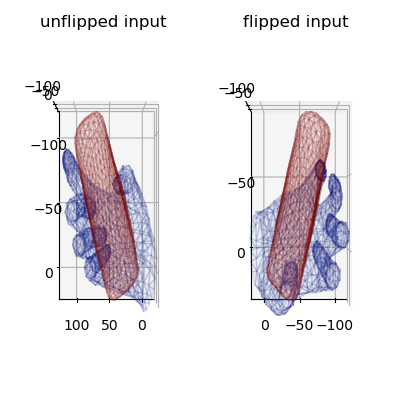
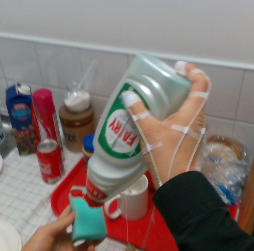
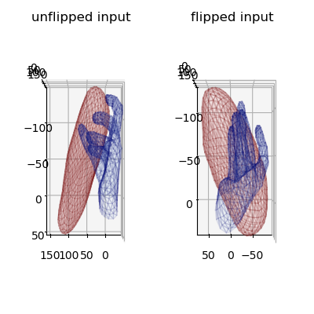
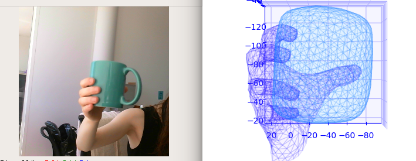

# Get the code

`git clone https://github.com/hassony2/obman_train`
`cd obman_train`

# Download and prepare datasets

## Download the ObMan dataset

- Download the dataset following [these instructions](https://github.com/hassony2/obman)
- Create a [symlink](https://www.cyberciti.biz/faq/creating-soft-link-or-symbolic-link/) `ln -s path/to/downloaded/obman datasymlinks/obman`
- Download  ShapeNetCore v2 object meshes from the [ShapeNet official website](https://www.shapenet.org/)
- Create a symlink `ln -s /sequoia/data2/dataset/shapenet/ShapeNetCore.v2 datasymlinks/ShapeNetCore.v2`

Your data structure should now look like

```
obman_train/
  datasymlinks/ShapeNetCore.v2
  datasymlinks/obman
```

## Download the First-Person Hand Action Benchmark dataset

- Follow the [official instructions](https://github.com/guiggh/hand_pose_action) to download the dataset


## Download model files

- Download model files from TODO
- unzip `unzip release_models.zip`

## Install python dependencies

- create conda environment with dependencies: `conda env create -f environment.yml`
- activate environment: `conda activate obman_train`


## Install the MANO PyTorch layer

- Follow the instructions from [here](https://github.com/hassony2/manopth)


### Download the MANO model files

- Go to [MANO website](http://mano.is.tue.mpg.de/)
- Create an account by clicking *Sign Up* and provide your information
- Download Models and Code (the downloaded file should have the format mano_v*_*.zip). Note that all code and data from this download falls under the [MANO license](http://mano.is.tue.mpg.de/license).
- unzip and copy the content of the *models* folder into the misc/mano folder


- Your structure should look like this:

```
obman_render/
  misc/
    mano/
      MANO_LEFT.pkl
      MANO_RIGHT.pkl
  release_models/
    fhb/
    obman/
    hands_only/

```


# Launch

## Training

`python traineval.py --atlas_predict_trans --atlas_predict_scale --atlas_mesh --mano_use_shape --mano_use_pca --freeze_batchnorm --atlas_separate_encoder`

## Demo


We provide a model trained on the synthetic ObMan dataset

### Video demo

You can test it on a recorded video or live using a webcam by launching :

`python webcam_demo.py --resume release_models/obman/checkpoint.pth.tar  --hand_side left`

Hand side detection is not handled in this pipeline, therefore, you should explicitly indicate whether you want to use the right or left hand with `--hand_side`.

Note that the video demo has some lag time, which comes from the visualization bottleneck (matplotlib image rendering is quite slow).

### Single image demo

`python image_demo.py --resume release_models/obman/checkpoint.pth.tar`

In this demo, both the original and flipped inputs are fed, and the outputs are therefore presented for the input treated as a right and a left hand side by side.

Running the demo should produce the following outputs.




You can also run this demo on data from the [First Hand Action Benchmark](https://github.com/guiggh/hand_pose_action)

`python image_demo.py --image_path readme_assets/images/fhb_liquid_soap.jpeg --resume release_models/fhb/checkpoint.pth.tar`




Note that the model trained on First Hand Action Benchmark strongly overfits to this dataset, and therefore performs poorly on 'in the wild' images.


### Limitations

- This demo doesn't operate hand detection, so the model expects a roughly centered hand
- As we are deforming a sphere, the topology of the object is 0, which explains results such as the following:



- the model is trained only on hands holding objects, and therefore doesn't perform well on hands in the absence of objects for poses that do not resemble common grasp poses.
- the mdoel is trained on grasping hands only, and therefore struggles with hand poses that are associated with object-handling
  - In addition to the models, we also provide a hand-only model trained on various hand datasets, including our ObMan dataset, that captures a wider variety of hand poses
  - to try it, launch `python webcam_demo.py --resume release_models/hands_only/checkpoint.pth.tar`

# Citations

If you find this code useful for your research, consider citing:

```
@INPROCEEDINGS{hasson19_obman,
  title     = {Learning joint reconstruction of hands and manipulated objects},
  author    = {Hasson, Yana and Varol, G{\"u}l and Tzionas, Dimitris and Kalevatykh, Igor and Black, Michael J. and Laptev, Ivan and Schmid, Cordelia},
  booktitle = {CVPR},
  year      = {2019}
}
```

# Acknowledgements

## AtlasNet code

Code related to [AtlasNet](http://imagine.enpc.fr/~groueixt/atlasnet/) is in large part adapted from the official [AtlasNet repository](https://github.com/ThibaultGROUEIX/AtlasNet).
Thanks [Thibault](https://github.com/ThibaultGROUEIX/) for the provided code !

## Hand evaluation code

Code for computing hand evaluation metrics was reused from [hand3d](https://github.com/lmb-freiburg/hand3d), courtesy of [Christian Zimmermann](https://lmb.informatik.uni-freiburg.de/people/zimmermc/) with an easy-to-use interface!


## Laplacian regularization loss

[Code](https://github.com/akanazawa/cmr) for the laplacian regularization and precious advice was provided by [Angjoo Kanazawa](https://people.eecs.berkeley.edu/~kanazawa/) !


## First Hand Action Benchmark dataset

Helpful advice to work with the dataset was provided by [Guillermo Garcia-Hernando](https://guiggh.github.io/) !
